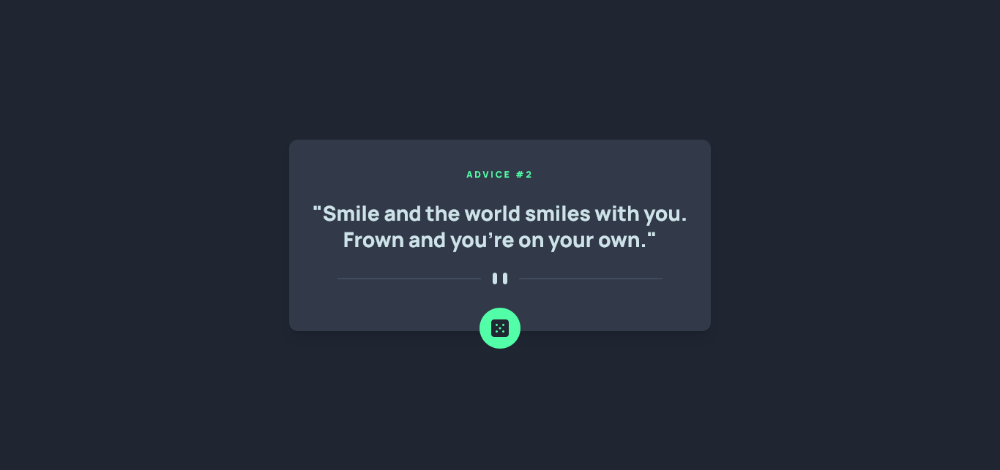

# Frontend Mentor - Advice Generator App solution

This is a solution to the [Advice generator app challenge on Frontend Mentor](https://www.frontendmentor.io/challenges/advice-generator-app-QdUG-13db). Frontend Mentor challenges help you improve your coding skills by building realistic projects.

## Table of contents

- [Frontend Mentor - Advice Generator App solution](#frontend-mentor---advice-generator-app-solution)
  - [Table of contents](#table-of-contents)
  - [Overview](#overview)
    - [Screenshot](#screenshot)
    - [Links](#links)
  - [My process](#my-process)
    - [Built with](#built-with)
    - [What I learned](#what-i-learned)
    - [Continued development](#continued-development)
    - [Useful resources](#useful-resources)
  - [Author](#author)
  - [Acknowledgments](#acknowledgments)

## Overview

### Screenshot



### Links

- Solution URL: [Right here!](https://www.frontendmentor.io/solutions/advice-generator-built-with-ssr-and-no-javascript-needed-BJuJheYQq)
- Live Site URL: [Deployed on Vercel](https://advice-generator-app-ogshawnlee.vercel.app/)

## My process

### Built with

- Semantic HTML5 markup
- Svelte + [Sveltekit](https://kit.svelte.dev/)
- TypeScript
- WindiCSS
- Flexbox
- Mobile-first workflow

### What I learned

I learnt to use the picture tag for displaying different images in certain viewports. This is awesome for building responsive layouts!

```html
<picture class="block mt-3 my-6">
	<source srcset="/pattern-divider-desktop.svg" media="(min-width: 640px)" />
	<source srcset="/pattern-divider-mobile.svg" media="(max-width: 640px)" />
	
</picture>
```

### Continued development

I just discovered the picture tag and how awesome it is; I feel like learning more about HTML tags and HTML in general would be great!

### Useful resources

- [Picture Tag on MDN Mozilla](https://developer.mozilla.org/es/docs/Web/HTML/Element/picture) - This was useful for understanding how the tag works.

## Author

- Frontend Mentor - [@Shawn Lee](https://www.frontendmentor.io/profile/OGShawnLee)

## Acknowledgments

Thanks to [Ivan](https://github.com/isprutfromua) I discovered the picture tag.
